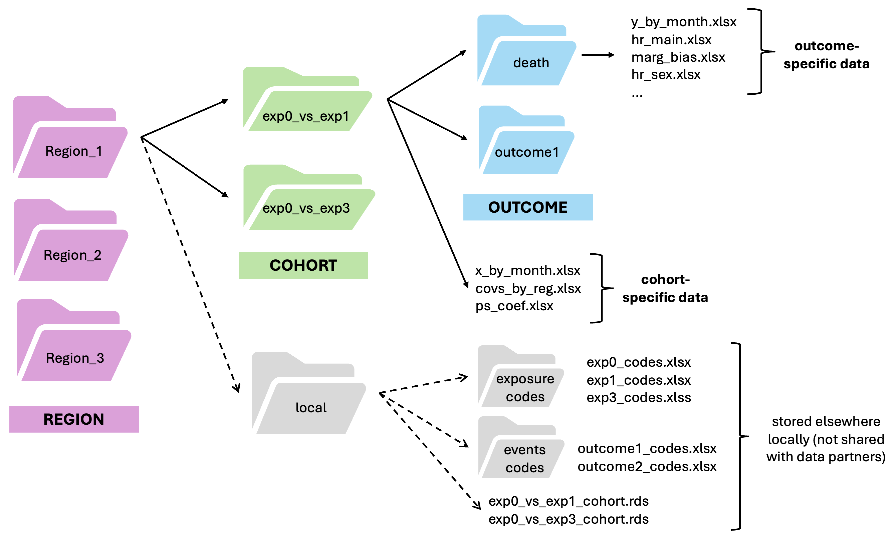
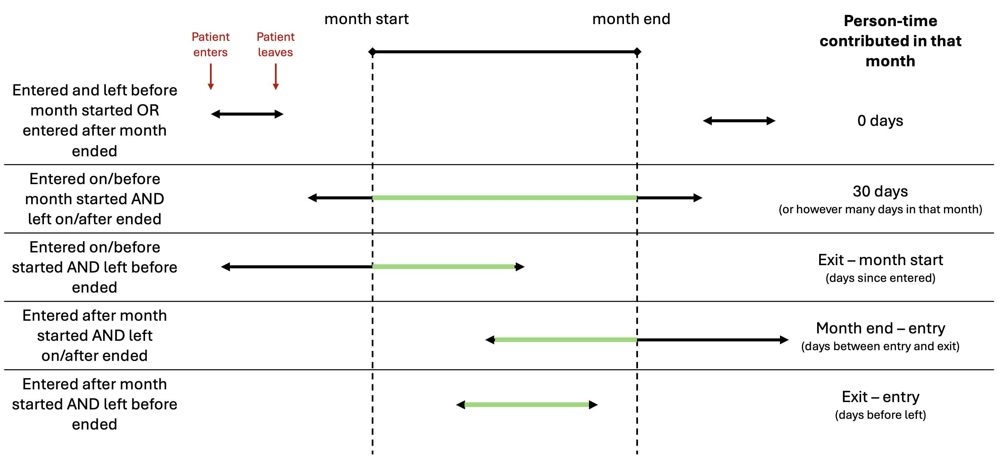

<style type="text/css">

body, td {
   font-size: 10px;
}
code.r{
  font-size: 10px;
}
pre {
  font-size: 10px
}
</style>

```{r, include = FALSE, echo = FALSE}
library(knitr, quietly = TRUE)
library(dplyr, quietly = TRUE)
library(magrittr, quietly = TRUE)
opts_chunk$set(tidy.opts=list(width.cutoff=60),tidy=TRUE)
options(dplyr.summarise.inform = FALSE)
```

# 0. Overview

This document describes the steps to generate the data tables behind the visualization tool through a toy example in R, so you can see what the tables look like and repeat these steps in your own data. You can find this document and the files to run it on https://github.com/gwenaubrac/ddn-visualization in the sample folder. This is just how I implemented the steps in R, but please do whatever you prefer as long as the final result follows the same structure! 

In this simple example, we are interested in the occurrence of death and outcome1 in patients who initiate exposure0 (exp0) versus those who initiate exposure1 (exp1). The covariates adjusted for are age, sex, history of outcome1, and history of covariate1. Because we are using an active comparator design to contrast the effects of exp0 and exp1, the results are specific to this comparison and will be saved in the corresponding folder 'exp0_vs_exp1'. If you've organized your code folders like below, you can easily repeat the analysis for another active comparator cohort by changing the variable 'analysis' to your comparison (e.g., exp3_vs_exp0) or for another outcome by changing the variable 'outcome' (e.g., outcome2). Each 'region' is a region or data partner (or center, or anything you'd like) represented by its own line and colors in the visualization tool. You can compile the final data tables from all regions together at the end to power the visualization tool. 



## 0.1 Set-up

First, let's just set up the paths to read the data and store the results. 

```{r, message = FALSE}
# Analysis: exposure groups being compared (a folder of this name should exist in your directory)
analysis <- 'exp0_vs_exp1'

# Region: data partner/region/node/center, whatever you want to compare!
region = 'regionA'

# Paths to folders
# the local folder is for your use only (as it will store patient-level data)
# whereas the result folder could be shared with a coordinating center/other researchers
path_local <- './local'
path_results <- paste0('./', analysis)
```

## 0.2 Create toy data
We will create the following toy dataframes that simulate patient data:    
- patient: patient demographics (id, birth date, male, death date, regimen start, regimen end)  
- prescriptions: prescription information (id, prescription date, product code)  
- clinical: clinical information containing diagnoses dates and codes (id, event date, event code)  
This next section of code is not important, it's just to generate some artificial data.

```{r, message = FALSE}
library(dplyr)
library(magrittr)

# number of patients
set.seed(1)
n <- 2000

# patient: contains id, birth date, sex, death date, regimen start, regimen end
patient_ids <- 1:n

birth_date <- as.Date('1930-01-01') + sample(0:(as.numeric(as.Date('2000-01-01')) - as.numeric(as.Date('1930-01-01'))), n, replace = TRUE)

male <- sample(c(0, 1), n, replace = TRUE)

death_date <- sapply(birth_date, function(birth_date) {
  if (runif(1) < 0.3) { # setting a 30% probability of death
    
    death_year <- sample(2018:2022, 1)
    death_date <- as.Date(paste(death_year, sample(1:12, 1), sample(1:28, 1), sep = "-"))
    
    if (death_date < birth_date) {
      death_date <- birth_date + sample(30:90, 1) * 365 # if death prior to entry artifically set to some years after birth
    }
    
    return(death_date)
  } else {
    return(NA)  
  }
})

patient <- data.frame(
  id = patient_ids,
  birth_date = birth_date,
  male = male,
  death_date = as.Date(death_date, origin = "1970-01-01") # ensures NAs are properly recognized
)

patient$reg_start <- sapply(1:n, function(i) {
  end_date <- ifelse(is.na(patient$death_date[i]), as.Date('2023-01-01'), patient$death_date[i])  
  sample(patient$birth_date[i]:end_date, 1)
})

# let's set 20% of patients to have a reg_end date
# and assume data source only contains data until 2023
patient$reg_end <- sapply(1:n, function(i) {
  if (runif(1) < 0.2) {  
    end_date <- ifelse(is.na(patient$death_date[i]), as.Date('2023-01-01'), patient$death_date[i]) 
    reg_end_date <- sample(patient$reg_start[i]:end_date, 1)  
    return(reg_end_date)
  } else {
    return(NA)  
  }
})

patient %<>% 
  mutate(reg_start = as.Date(reg_start),
         reg_end = as.Date(reg_end))

head(patient)

# prescription: contains id, prescription date, product code
rx_per_patient <- sample(1:10, n, replace = TRUE) # number of rx each patient has
rx_prod_codes <- character(sum(rx_per_patient)) # vector to store rx prod codes
rx_dates <- as.Date(character(sum(rx_per_patient)))
rx_durations <- numeric(sum(rx_per_patient))

index <- 1
for (patient_id in patient$id) {
  n_prescriptions <- rx_per_patient[patient_id]
  
  rx_prod_codes[index] <- sample(c('prod1', 'prod2', 'prod3', 'prod4', 'prod5'), 1)
  
  rx_dates[index] <- as.Date('2018-01-01') + sample(0:(as.numeric(as.Date('2023-01-01')) - as.numeric(as.Date('2018-01-01'))), 1)
  
  rx_durations[index] <- sample(25:120, 1)
  
  for (i in 2:n_prescriptions) {
    
    # let's artificially set a 70% prob of another rx for same product
    if (runif(1) < 0.7) {  
      rx_prod_codes[index + i - 1] <- rx_prod_codes[index + i - 2]
    } else {
      rx_prod_codes[index + i - 1] <- sample(c('prod1', 'prod2', 'prod3', 'prod4', 'prod5'), 1)
    }
    
    rx_dates[index + i - 1] <- as.Date('2018-01-01') + sample(0:(as.numeric(as.Date('2023-01-01')) - as.numeric(as.Date('2018-01-01'))), 1)
    
    rx_durations[index + i - 1] <- sample(15:90, 1)
  }
  
  index <- index + n_prescriptions
}

prescription <- data.frame(
  id = rep(patient$id, rx_per_patient),
  rx_date = rx_dates,
  product_code = rx_prod_codes,
  duration = rx_durations
)

prescription %<>% arrange(id, rx_date)

head(prescription)

# clinical: contains id, event date, event code
events_per_patient <- sample(1:5, n, replace = TRUE)
event_codes <- character(sum(events_per_patient))
event_dates <- as.Date(character(sum(events_per_patient)))

index <- 1  
for (patient_id in patient$id) {
  n_events <- events_per_patient[patient_id]
  event_codes[index] <- sample(c('event1', 'event2', 'event3', 'event4', 'cov1', 'cov2', 'cov3', 'cov4', 'cov5', 'cov6'), 1)
  
  event_dates[index] <- as.Date('2017-01-01') + sample(0:(as.numeric(as.Date('2023-01-01')) - as.numeric(as.Date('2017-01-01'))), 1)
  
  for (i in 2:n_events) {
    event_codes[index + i - 1] <- sample(c('event1', 'event2', 'event3', 'event4', 'cov1', 'cov2', 'cov3', 'cov4', 'cov5', 'cov6'), 1)
    
    event_dates[index + i - 1] <- as.Date('2017-01-01') + sample(0:(as.numeric(as.Date('2023-01-01')) - as.numeric(as.Date('2017-01-01'))), 1)
  }
  
  index <- index + n_events
}

clinical <- data.frame(
  id = rep(patient$id, events_per_patient),
  event_date = event_dates,
  event_code = event_codes
)

head(clinical)

rm(death_date, birth_date, rx_durations, event_codes, event_dates, events_per_patient, i, index, n, n_events, n_prescriptions, patient_id, patient_ids, rx_dates, rx_per_patient, rx_prod_codes, male)
```


# 1. Cohort creation

We will now create a **cohort** dataframe containing new users of the treatments of interest. This data frame will not be shared between data partners but will be used to generate the desired descriptive data output.  

*Inclusion criteria:* Patients enter the cohort if they have a first prescription for the exposures of interest between January 1st, 2019, and December 31st, 2022. The 'rx_for_exposure' data frame contains all prescriptions (rx) for the treatments of interest (so, it will include the variables id, product code, rx_date, first_rx_date, rx_duration, rx_group) and will be used later to define treatment discontinuation or switch in the as-treated analyses. 

*Note:* In the CPRD data, we created the 3 following cohorts:  
1. New users of antidepressant medications, which include SNRIs and SSRIs (antidepressant_cohort data frame)  
2. New users of antihypertensive medications, which include ARBs and ACEIs (antihypertensive_cohort data frame)  
3. New users of antidiabetic medications, which include SGLT-2s, GLP1-RAs, DPP4s, and SUs (antidiabetic_cohort data frame) who are taking metformin at the time of treatment initiation. For new antidiabetic users (SGLT-2s, GLP1-RAS, DPP4s and SUs), we identified all new users of those treatments, selected the first prescription (which designates cohort entry), and then excluded patients who did not have a metformin prescription at their time of cohort entry. 

```{r, message = FALSE}
library(dplyr)
library(magrittr)
library(readxl)

# specify study design
study_start <- as.Date('2019-01-01')
study_end <- as.Date('2022-12-31')

# read codes for exposures of interest from the folder containing code excel files
exposure_codes <- data.frame()
exposure_files <- list.files(paste(path_local, 'exposure_codes', sep = '/'), pattern = '.xlsx', all.files = TRUE, full.names = TRUE)

for (file in exposure_files) {
  data <- read_excel(file, trim_ws = TRUE, col_type = 'text')
  data$exposure <- tools::file_path_sans_ext(basename(file))
  exposure_codes <- bind_rows(exposure_codes, data)
}

head(exposure_codes)

# identify patients' first rx for any of the exposures of interest
# and keep only first rx occurring during study period
rx_for_exposure <- prescription %>% 
  filter(product_code %in% exposure_codes$ProductCode) %>% 
  group_by(id) %>% 
  mutate(first_rx = min(rx_date)) %>% 
  filter(first_rx >= study_start & first_rx <= study_end)

rx_for_exposure <- merge(rx_for_exposure, exposure_codes, by.x = 'product_code', by.y = 'ProductCode', all.x = TRUE)

rx_for_exposure %<>% 
  arrange(id, rx_date)

head(rx_for_exposure)

# patients may have a received an rx for both exp0 and exp1
# but in that case, whichever occurred first designates cohort entry
first_rx_for_exposure <- rx_for_exposure %>% 
  group_by(id) %>% 
  slice(1) %>% 
  rename(entry_date = first_rx) %>% 
  select(-product_code, -Product, -rx_date)

head(first_rx_for_exposure)

rm(exposure_codes, exposure_files)
```

*Exclusion criteria:*   
We will now exclude patients based on our exclusion criteria:
1. <18 years old at entry  
2. <365 days of look-back available in database  
3. <365 days of follow-up available in database (be careful about excluding patients based on regimen end because regimen may end due to death)    
4. No linkage to linked data (if applicable)  
5. Missing sex or data entry error for birth date/death date
From here on, 'treatment' refers to the treatment a patient entered the cohort with and is our explanatory variable of interest. We are differentiating this from 'exposure' in the rx_for_exposure table, which is the the treatment group of a product but not necessarily the one the patient entered with. This is not important right now, but will come into use when we censor patients at treatment discontinuation. 

```{r, message = FALSE}
library(dplyr)
library(magrittr)
library(lubridate)

cohort <- merge(first_rx_for_exposure, patient, by = 'id', all.x = TRUE)

# treatment = treatment patient entered the cohort with
# whereas exposure = treatment group of a product in 'rx_for_exposure'
# (used later to define treatment discontinuation)
cohort %<>% rename(treatment = exposure)

## Exclusion 1: <18 at entry
cohort %<>%
  mutate(age_at_entry = time_length(difftime(entry_date, birth_date), 'years'))

cohort %<>% filter(age_at_entry>=18)

## Exclusion 2: <365 days of look-back available
cohort %<>% filter(entry_date - reg_start >= 365)

## Exclusion 3: <365 days of follow-up available  
# note: the following steps ensure we're not excluding patients who died 
# within 1 year (otherwise we'd introduce survival bias through our exclusion criteria)
# because patients' regimens ends with their death

# a) identify patients who did not die and whose regimen ended within a year of entry
cohort %<>%
  mutate(less_than_year_alive = if_else(is.na(death_date) &
                                          !is.na(reg_end) &
                                          reg_end - entry_date < 365, 1, 0))

# b) identify patients who died after regimen end and whose regimen ended within year of entry
cohort %<>%
  mutate(less_than_year_died = if_else(
    !is.na(death_date) &
      !is.na(reg_end) &
      death_date > reg_end &
      reg_end - entry_date < 365,
    1,
    0
  ))

# exclude patients from a) and b)
cohort %<>%
  filter(less_than_year_alive == 0,
         less_than_year_died == 0)

cohort %<>%
  select(-less_than_year_alive, -less_than_year_died)

## Exclusion 4: No linkage to linked data
# not shown for simplicity

## Exclusion 5: Data entry errors or missing sex  
# remove patients who died prior to cohort entry  
# remove patients who died prior to date of birth  
# and remove patients with missing sex  
cohort %<>%
  filter(is.na(death_date) | death_date > entry_date) %>% 
  filter(is.na(death_date) | death_date > birth_date) %>%
  filter(!is.na(male))

rm(first_rx_for_exposure)
```


# 2. Covariates and events

Great! Now, let us add the following covariates to our cohort data frame: age group, sex, year of entry, and baseline occurrence of events (i.e., outcome and covariates).

For categorical variables, we are setting the largest group as the reference.

For events, two dates are extracted: date of first occurrence ever ('event_date_base') and date of first occurrence since cohort entry ('event_date'). The date of first occurrence ever is used to define history of the event, captured by the flag 'event_base' if it occurred prior to cohort entry, whereas the date of first occurrence since entry is used to define the event as an outcome, capture by the flag 'event' if it occcured after cohort entry. 

```{r, message = FALSE}
library(dplyr)
library(magrittr)
library(tidyr)

## Covariates: age group, sex, year of entry  
# year of entry
# also getting month of entry for plotting later
cohort$year <- as.factor(format(cohort$entry_date, '%Y'))
cohort$month <- as.factor(format(as.Date(cohort$entry_date), '%Y-%m'))

# age group  
cohort %<>%
  mutate(
    age_group = case_when(
      age_at_entry>=18 & age_at_entry<25 ~ '18-24',
      age_at_entry>=25 & age_at_entry<35 ~ '25-34',
      age_at_entry>=35 & age_at_entry<45 ~ '35-44',
      age_at_entry>=45 & age_at_entry<55 ~ '45-54',
      age_at_entry>=55 & age_at_entry<65 ~ '55-64',
      age_at_entry>=65 & age_at_entry<75 ~ '65-74',
      age_at_entry>=75 & age_at_entry<85 ~ '75-84',
      age_at_entry>=85 ~ '>85'),
    age_group = factor(age_group, levels = c('18-24', '25-34', '35-44', '45-54', '55-64', '65-74', '75-84', '>85'))
    )

table(cohort$age_group)

# set reference group to largest group  
most_common_age_cat <- cohort %>%
  count(age_group) %>%
  slice_max(n) %>%
  pull(age_group)

cohort$age_group <- relevel(cohort$age_group, ref = as.character(most_common_age_cat))
levels(cohort$age_group)

## All-cause mortality (death)
cohort %<>% mutate(death = if_else(!is.na(death_date), 1, 0))

## Clinical events  
# first let us read the event codes  
# from our folder containing the excel code files
event_codes <- data.frame()
event_code_files <- list.files(
  path = paste(path_local, 'event_codes', sep = '/'),
  pattern = '.xlsx',
  all.files = TRUE,
  full.names = TRUE
)

for (file in event_code_files) {
  data <- read_excel(file, trim_ws = TRUE, col_type = 'text')
  data$event_name <- tools::file_path_sans_ext(basename(file))
  event_codes <- bind_rows(event_codes, data)
}

head(event_codes)
rm(file, data, event_code_files)

# identify occurrence of events from diagnoses  
cohort_events <- clinical %>% 
  select(id, event_code, event_date) %>% 
  filter (id %in% cohort$id) %>% 
  filter (event_code %in% event_codes$Code) %>% 
  arrange(id, event_date)

cohort_events <- merge(cohort_events, event_codes, by.x = 'event_code', by.y = 'Code')
rm(event_codes)

# baseline event: occurrence prior to cohort entry based on first event date  
cohort_events_base <- cohort_events %>% 
  group_by(id, event_name) %>% 
  summarise(event_date_base = min(event_date)) %>% 
  ungroup()

# pivot so that column is event, row is ID, and cell contains date of first event  
cohort_events_base %<>%
  pivot_wider(id_cols = id, names_from = event_name, values_from = event_date_base)

# for each event, get the name, date of first occurrence, and merge with cohort,  
# changing variable names accordingly  
for (i in 2:ncol(cohort_events_base)) {
  event_name <- names(cohort_events_base[i])
  event_base_i <- cohort_events_base[, c('id', event_name)]
  cohort <- merge(cohort, event_base_i, by = 'id', all.x = TRUE)
  cohort %<>% rename(event_date_base = !!event_name)
  cohort %<>%
    mutate(event_base = as.factor(if_else (!is.na(event_date_base) & event_date_base < entry_date, 1, 0)))
  cohort %<>% rename(!!paste(event_name, 'date_base', sep = '_') := event_date_base)
  cohort %<>% rename(!!paste(event_name, 'base', sep = '_') := event_base)
}

rm(cohort_events_base, event_name, event_base_i, i)

# event: first occurrence since entry  
# same approach but only for events occurring after entry  
cohort_entry_dates <- cohort %>%
  select(id, entry_date)

cohort_study_events <- merge(cohort_events, cohort_entry_dates, all.x = TRUE, by = 'id') %>% 
  filter(event_date > entry_date) %>% 
  group_by(id, event_name) %>% 
  summarise(study_event_date = min(event_date)) %>% 
  ungroup()
  
cohort_study_events %<>%
  pivot_wider(id_cols = id, names_from = event_name, values_from = study_event_date)

for (i in 2:ncol(cohort_study_events)) {
  event_name <- names(cohort_study_events[i])
  study_event_i <- cohort_study_events[, c('id', event_name)]
  cohort <- merge(cohort, study_event_i, by = 'id', all.x = TRUE)
  cohort %<>% rename(study_event_date = !!event_name)
  cohort %<>%
    mutate(event = as.factor(if_else (!is.na(study_event_date), 1, 0)))
  cohort %<>% rename(!!paste(event_name, 'date', sep = '_') := study_event_date)
  cohort %<>% rename(!!event_name := event)
}

rm(cohort_study_events, cohort_entry_dates, event_name, study_event_i, i)
rm(cohort_events, most_common_age_cat)
```


# 3. Censoring

In the AT analysis, patients will be censored when they discontinue their treatment based on a defined grace period or when they switch treatments. To do so, we will add the following variables to **cohort**:  
- disc_date: date of discontinuation using 30-day grace period  
- switch_date: date of rx for another treatment for the same condition (when treatments cannot be used concurrently)
- disc_date_sens: date of discontinuation using 90-day grace period (sensitivity analysis)  

We can refer to rx_for_exposure, which contains all of the patients' prescriptions for the treatments being compared. 
From that, we can identify how long a patient was supplied with the medication that they entered the cohort with, and when they received a prescription for a medication that cannot be used concurrently with their current one. Both of these events are evidence of treatment discontinuation and would lead to a patient being censored at that time.

## 3.1 Treatment discontinuation

Let's start by identifying the date of treatment discontinuation based on the medication supply. 

### 3.1.1 For 30-day grace period (main analysis)
```{r, message = FALSE}
library(dplyr)
library(magrittr)

# retrieve all prescriptions for exposure
# and extract which treatment patient entered the cohort with
trt_supply <- rx_for_exposure %>% 
  filter(id %in% cohort$id)

id_trt <- cohort %>% select(id, treatment)
trt_supply <- merge(trt_supply, id_trt, by.x = c('id'), by.y = c('id'), all.x = TRUE)

# keep only rx for exposure leading to entry
# exposure refers to the treatment group of the prescription 
# and treatment refers to the treatment group a patient entered the cohort with
trt_supply %<>% filter(exposure == treatment)

# calculate days between end of rx supply and date of next rx
trt_supply <- trt_supply %>% 
  group_by(id) %>% 
  arrange(id, rx_date) %>% 
  select(id, treatment, rx_date, duration) %>% 
  mutate(
    refill_number = row_number(),
    supply_end = rx_date+duration, 
    gap_in_supply = rx_date - lag(supply_end), # gap between current rx and end of previous rx
    max_refills = max(refill_number, na.rm = TRUE) # total number of rx a patient got for that trt
  )

trt_supply_sens <- trt_supply # for sensitivity analysis later

## Three scenarios for treatment discontinuation due to medication supply running out:
# 1. Patient only has 1 refill (single refill), in which case medication supply ends at the end of refill
# 2. Patient has 30+ day gap in refills (gap in refill)
# 3. Patient's last refill does not last beyond study end (last refill)
# In all those cases, we censor the patient 30 days after (or whatever your grace period is).

grace_period <- 30

# 1. for single refill, disc date is supply end + grace period of first rx
trt_supply$disc_date_single <- NA
trt_supply %<>%
  mutate(disc_date_single = if_else(max_refills == 1, supply_end + grace_period, disc_date_single))

# 2. for multiple refills, disc date is supply end prior to 30-day gap + 30 days
# returns inf if no gap
trt_supply$disc_date_gap <- NA
trt_supply %<>% 
  mutate(
    prior_supply_end = lag(supply_end),
    gap = if_else(!is.na(gap_in_supply) & gap_in_supply>grace_period, 1, 0),
    disc_date_gap = if_else(gap == 1, prior_supply_end + grace_period, disc_date_gap)
         )

# 3. for no gap, disc date is supply end of last rx + grace period
# so we get patients with no disc from single fill or gap in refills
# and get the supply end date of their last rx
no_disc_dates <- trt_supply %>% 
  filter(all(is.na(disc_date_single) & all(is.na(disc_date_gap) | is.infinite(disc_date_gap)))) %>% 
  arrange(desc(supply_end)) %>% 
  slice(1) %>% 
  mutate(disc_date_last = supply_end + grace_period)

no_disc_dates %<>% select(id, disc_date_last)

trt_supply <- merge(trt_supply, no_disc_dates, by = 'id', all.x = TRUE)

# finally, we get earliest disc date from 3 scenarios 
# (there should be only 1 per patient, but just in case)
# if disc date is after study end, the patient is not considered to have discontinued
# and is thus not censored
disc_dates <- trt_supply %>% 
  group_by(id) %>% 
  mutate(
    disc_date_gap = if_else(is.infinite(disc_date_gap), NA, disc_date_gap),
    disc_date = min(disc_date_single, disc_date_gap, disc_date_last, na.rm = TRUE),
    disc_date = if_else(disc_date > study_end, NA, disc_date)
    ) %>% 
  slice(1)

disc_dates %<>% select(id, disc_date)
cohort <- merge(cohort, disc_dates, by = 'id', all.x = TRUE)

rm(disc_dates, no_disc_dates, trt_supply, grace_period)
```

### 3.1.2 For 90-day grace period (sensitivity analysis)

We can repeat 3.1.1 but using a 90-day grace period for our sensitivity analysis. 

```{r, message = FALSE}
library(dplyr)
library(magrittr)

grace_period <- 90

# 1. for single refill, disc date is supply end + grace period of first rx
trt_supply_sens$disc_date_single <- NA
trt_supply_sens %<>%
  mutate(disc_date_single = if_else(max_refills == 1, supply_end + grace_period, disc_date_single))

# 2. for multiple refills, disc date is supply end prior to 30-day gap + 30 days
# returns inf if no gap
trt_supply_sens$disc_date_gap <- NA
trt_supply_sens %<>% 
  mutate(
    prior_supply_end = lag(supply_end),
    gap = if_else(!is.na(gap_in_supply) & gap_in_supply>grace_period, 1, 0),
    disc_date_gap = if_else(gap == 1, prior_supply_end + grace_period, disc_date_gap)
         )

# 3. for no gap, disc date is supply end of last rx + grace period
no_disc_dates <- trt_supply_sens %>% 
  filter(all(is.na(disc_date_single) & all(is.na(disc_date_gap) | is.infinite(disc_date_gap)))) %>% 
  arrange(desc(supply_end)) %>% 
  slice(1) %>% 
  mutate(disc_date_last = supply_end + grace_period)

no_disc_dates %<>% select(id, disc_date_last)

trt_supply_sens <- merge(trt_supply_sens, no_disc_dates, by = 'id', all.x = TRUE)

# get earliest disc date from 3 scenarios 
disc_dates_sens <- trt_supply_sens %>% 
  group_by(id) %>% 
  mutate(
    disc_date_gap = if_else(is.infinite(disc_date_gap), NA, disc_date_gap),
    disc_date_sens = min(disc_date_single, disc_date_gap, disc_date_last, na.rm = TRUE),
    disc_date_sens = if_else(disc_date_sens > study_end, NA, disc_date_sens)
    ) %>% 
  slice(1)

disc_dates_sens %<>% select(id, disc_date_sens)
cohort <- merge(cohort, disc_dates_sens, by = 'id', all.x = TRUE)

rm(trt_supply_sens, disc_dates_sens, no_disc_dates, grace_period)
```

## 3.2 Treatment switch

Let's now identify the date patients switch to another medication that cannot be used concurrently. To do this, we refer to rx_for_exposure and see if patients had a prescription for a treatment not leading to cohort entry. If they did, the prescription date for that second treatment marks the switch date.

```{r, message = FALSE}
library(dplyr)
library(magrittr)

# Retrieve all prescriptions for exposure
trt_switch <- rx_for_exposure %>% 
  filter(id %in% cohort$id)

id_trt <- cohort %>% select(id, treatment)
trt_switch <- merge(trt_switch, id_trt, by = 'id', all.x = TRUE)

# Keep only rx for exposure NOT leading to entry
trt_switch %<>% filter(exposure != treatment)

# Switch date is earliest date of rx for exposure other than the one leading to entry
trt_switch %<>%
  group_by(id) %>% 
  mutate(switch_date = min(rx_date)) %>% 
  slice(1) %>% 
  select(id, switch_date)

cohort <- merge(cohort, trt_switch, by = 'id', all.x = TRUE)

rm(trt_switch, id_trt, rx_for_exposure)
```

# 4. Analyses

Now that the active comparator cohort is created, we can generate the tables for the visualization tool. Some tables describe the cohort (number of patients, their characteristics, etc.) whereas other tables describe specific outcomes (incidence rates, bias, etc.). So, generating these tables can be done in 2 steps:

1. Cohort-specific descriptive data: These dataframes describe the active comparator cohort directly. In this example, the cohort is exp0_vs_exp1. 
a) **ps_coef:** coefficients of association between covariates and treatment  
b) **x_by_month:** number of patients in each treatment group for each month  
c) **covs:** number of patients with certain covariates
d) **smd:** standardized mean differences of covariates between treatment groups (unadjusted)  
  
2. Outcome-specific descriptive data: These dataframes describe each outcome within each active comparator cohort.  In this example, we create dataframes for outcome1 for exp0_vs_exp1. 
a) **hr_main:** hazard ratio for main analysis (for both the ITT and AT analyses)
b) **hr_sex:** hazard ratio in subgroups by sex  
c) **hr_sens:** hazard ratio for sensitivity analysis (using 90-day grace period in the AT)
d) **marg_bias:** marginal bias terms  
e) **y_by_month:** crude monthly outcome incidence rate  

All tables will be tagged with the corresponding 'region' column, and the final data will be compiled across regions. 

Let us first set the reference treatment. We'll use a binary variable 'trt'. 

```{r}
cohort$trt <- if_else(cohort$treatment == 'exp0', 0, 1)
```

## 4.1 Cohort-Specific Descriptive Data

## 4.1.1 Propensity score coefficients (a)

We compute inverse probability of treatment weights (IPTW) from a propensity score model including specified covariates (cov_var: vector with names of the demographic variables; cov_events: vector with names of the baseline occurrence of clinical events). The covariates included in the IPTW may differ between analyses.

We're then interested in extracting the coefficient for each covariate in the model, which describes the strength of the association between that variable and treatment.

```{r, message = FALSE, warning = FALSE}
library(broom)
library(writexl)

# define the models to be included in the propensity score model
cov_var <- c('age_group', 'male')
cov_events <- c('outcome1_base', 'cov1_base')
covariates <- c(cov_var, cov_events)
summary(cohort[covariates])

# estimate propensity score + IPTW
ps_model <- reformulate(covariates, 'trt')
ps_model

ps_fit <- glm(ps_model, family = binomial, data = cohort)
cohort$prop_score <- predict(ps_fit, type = 'response')

cohort$iptw <- if_else(cohort$trt == 0, 1 / (1 - cohort$prop_score), 1 / ps)
summary(cohort$iptw)
sd(cohort$iptw)

# get propensity scores coef for covariates
ps_coef <- tidy(ps_fit)

ps_coef %<>%
  filter(term != '(Intercept)') %>% 
  mutate(odds_ratio = exp(estimate)) %>% 
  rename(cov_name = term) %>%
  select(cov_name, estimate, odds_ratio)

head(ps_coef)

# tag table accordingly and save it in the folder
cohort$region <- region
cohort$analysis <- analysis
write_xlsx(ps_coef, paste(path_results, 'ps_coef.xlsx', sep = '/'))
rm(ps_model, ps_fit)
```

### 4.1.2 Patients in each treatment group by month (b)

We describe the number of patients who initiated the treatment in each month. 

```{r}
x_by_month <- cohort %>% 
  group_by(month, trt) %>% 
  summarize(num_patients = n())

x_by_month$region <- region
x_by_month$analysis <- analysis

head(x_by_month)
write_xlsx(x_by_month, paste(path_results, 'x_by_month.xlsx', sep = '/'))
```

### 4.1.3 Covariate prevalence (c)

We describe the number and proportion of patients who had certain covariate values. For example, how many patients were male? How many have a history of outcome1 at baseline?

We then describe these proportions specifically for treated and untreated patients. 

```{r, message = FALSE}
library(dplyr)
library(magrittr)
library(tidyr)

## Get number of event occurrences throughout study

# for binary covariates
covs_bin <- cohort %>% 
  summarise(across(all_of(covariates), ~ sum(. == 1, na.rm = TRUE)))

covs_bin %<>%
  pivot_longer(cols = -c(), names_to = 'cov_name', values_to = 'count')

# for multi-category covariates
covs_age <- cohort %>%
  group_by(age_group) %>%
  summarise(count = n(), .groups = "drop") %>% 
  rename(cov_name = age_group) %>% 
  mutate(cov_name = paste0('age_group', cov_name))

# merge results
covs <- bind_rows(covs_bin, covs_age)

## For treated only
covs_trt1_bin <- cohort %>% 
  filter(trt == 1) %>% 
  summarize(across(all_of(cov_events), ~sum(. == 1, na.rm = TRUE)))

covs_trt1_bin %<>%
  pivot_longer(cols = -c(), names_to = 'cov_name', values_to = 'count_trt1')

covs_trt1_age <- cohort %>%
  filter(trt == 1) %>% 
  group_by(age_group) %>%
  summarise(count_trt1 = n(), .groups = "drop") %>% 
  rename(cov_name = age_group) %>% 
  mutate(cov_name = paste0('age_group', cov_name))

covs_trt1 <- bind_rows(covs_trt1_bin, covs_trt1_age)

## For untreated only
covs_trt0_bin <- cohort %>% 
  filter(trt == 0) %>% 
  summarize(across(all_of(cov_events), ~sum(. == 1, na.rm = TRUE)))

covs_trt0_bin %<>%
  pivot_longer(cols = -c(), names_to = 'cov_name', values_to = 'count_trt0')

covs_trt0_age <- cohort %>%
  filter(trt == 0) %>% 
  group_by(age_group) %>%
  summarise(count_trt0 = n(), .groups = "drop") %>% 
  rename(cov_name = age_group) %>% 
  mutate(cov_name = paste0('age_group', cov_name))

covs_trt0 <- bind_rows(covs_trt0_bin, covs_trt0_age)

## Final: merge data for overall, treated, and untreated
covs <- merge(covs, covs_trt1, by = 'cov_name')
covs <- merge(covs, covs_trt0, by = 'cov_name')

covs$region <- region
covs$analysis <- analysis

head(covs)

write_xlsx(covs, paste(path_results, 'covs.xlsx', sep = '/'))
rm(covs_trt0, covs_trt1, covs_trt0_age, covs_trt0_bin, covs_trt1_age, covs_trt1_bin)
```

## 4.1.4 Standardized mean differences (d)

We compute the standardized mean differences in covariates between treatment groups. This describes the imbalance in that covariate, as a high SMD indicates a large difference in the proportion of patients who have that covariate between both groups. 

*Note*: Please do not compute absolute SMDs.  

```{r, message = FALSE}
library(dplyr)
library(magrittr)
library(cobalt)

# use cobalt package to get SMD table
cohort_covs <- cohort %>% select(all_of(covariates))
bal_tab <- bal.tab(
  trt ~ cohort_covs,
  data = cohort,
  s.d.denom = 'pooled'
)

# format results
smd <- bal_tab$Balance
smd$cov_name <- rownames(smd)
rownames(smd) <- NULL

smd %<>%
  select(Diff.Un, cov_name) %>% 
  rename(SMD = Diff.Un) 

smd$region <- region
smd$analysis <- analysis

head(smd)

write_xlsx(smd, paste(path_results, 'smd.xlsx', sep = '/'))
rm(cohort_covs, bal_tab)
```

## 4.2 Outcome-specific Descriptive Data

Now we can move onto the tables that describe specific outcomes. We first define the outcome of interest, for which we obtained information on occurrence at baseline ('event_base'/'event_date_base') and occurrence since entry ('event'/'event_date') in step 2. Then, we define ITT and AT follow-up as the time elapsed between cohort entry and cohort exit: 
- **ITT exit** is the first among: regimen end (or equivalent), death, occurrence of the event, or study end.  
- **AT exit** is the first among: ITT exit, discontinuation date, or switch date.  
You can add all of the code in 4.2 inside a loop to repeat this step for all outcomes specified in a list 'outcome_list'. Some outcomes might only be evaluated for certain cohorts, so you can add conditions for that before running the loop. 
For simplicity, we are just doing 'death' and not outcome1, but you can repeat the loop for 'outcome1' as the outcome. 

```{r, message = FALSE}
library(dplyr)
library(magrittr)

# optional to repeat for multiple outcomes:
# outcome_list <- c('death', 'outcome1', ...)
# for (outcome in outcome_list) {
# [check if outcome should be evaluated for that cohort]
# [code in section 4.2]
# ...
# }

## Define outcome
outcome <- 'death'
cohort_analytic <- cohort
cohort_analytic$event <- cohort_analytic[[outcome]]
cohort_analytic$event_date <- cohort_analytic[[paste(outcome, 'date', sep = '_')]]

## Define ITT exit and event
cohort_analytic$itt_exit_date <- pmin(
  cohort_analytic$reg_end,
  cohort_analytic$death_date, 
  cohort_analytic$event_date,
  study_end,
  na.rm = TRUE
)

# patient has ITT event if event occurred prior to ITT exit
cohort_analytic %<>% 
  mutate(
    itt_event = if_else((!is.na(event_date) & event_date <= itt_exit_date), 1, 0),
    itt_event_date = if_else(itt_event == 1, event_date, NA)
  )

## Define AT exit and event
cohort_analytic$at_exit_date <- pmin(
  cohort_analytic$itt_exit_date,
  cohort_analytic$disc_date,
  cohort_analytic$switch_date,
  na.rm = TRUE
)

# patient has AT event if event occurred prior to AT exit
cohort_analytic %<>% 
  mutate(
    at_event = if_else((!is.na(event_date) & event_date <= at_exit_date), 1, 0),
    at_event_date = if_else(at_event == 1, event_date, NA)
  )

head(cohort_analytic)
```

### 4.2.1 Hazard Ration in Main Cohort (a)

To obtain the marginal hazard ratio, we fit a Cox proportional hazard model weighted by the IPTW with robust estimators for the confidence interval. 

```{r, message = FALSE, warning = FALSE}
library(survival)

cox_itt <- coxph(
  Surv(as.numeric(itt_exit_date - entry_date), itt_event) ~ trt,
  data = cohort_analytic,
  weights = iptw,
  cluster = id,
  robust = TRUE
)

cox_at <- coxph(
  Surv(as.numeric(at_exit_date - entry_date), at_event) ~ trt,
  data = cohort_analytic,
  weights = iptw,
  cluster = id,
  robust = TRUE
)

# create a table with columns for the estimate and 95% CI
# and rows for the ITT and AT analysis results
hr_main <- data.frame(matrix(nrow = 2, ncol = 3))
colnames(hr_main) <- c('hr_estimate', 'hr_ci_lower', 'hr_ci_upper')
rownames(hr_main) <- c('ITT', 'AT')

hr_main[1, 'hr_estimate'] <- exp(cox_itt$coef)
hr_main[1, 'hr_ci_lower'] <- exp(confint(cox_itt))[1]
hr_main[1, 'hr_ci_upper'] <- exp(confint(cox_itt))[2]

hr_main[2, 'hr_estimate'] <- exp(cox_at$coef)
hr_main[2, 'hr_ci_lower'] <- exp(confint(cox_at))[1]
hr_main[2, 'hr_ci_upper'] <- exp(confint(cox_at))[2]

hr_main$region <- region
hr_main$analysis <- analysis

head(hr_main)

write_xlsx(hr_main, paste(path_results, outcome, 'hr_main.xlsx', sep = '/'))
rm(cox_itt, cox_at)
```

### 4.2.2 Hazard Ratio by Sex (b)

We repeat the same steps in subgroups based on sex. 

```{r, message = FALSE}
library(survival)

# Hazard ratio for males
cox_itt_male <- coxph(
  Surv(as.numeric(itt_exit_date - entry_date), itt_event) ~ trt,
  data = cohort_analytic,
  weights = iptw,
  cluster = id,
  robust = TRUE, 
  subset = male==1
)

cox_at_male <- coxph(
  Surv(as.numeric(at_exit_date - entry_date), at_event) ~ trt,
  data = cohort_analytic,
  weights = iptw,
  cluster = id,
  robust = TRUE,
  subset = male==1
)

# Hazard ratio for females
cox_itt_female <- coxph(
  Surv(as.numeric(itt_exit_date - entry_date), itt_event) ~ trt,
  data = cohort_analytic,
  weights = iptw,
  cluster = id,
  robust = TRUE,
  subset = male==0
)

cox_at_female <- coxph(
  Surv(as.numeric(at_exit_date - entry_date), at_event) ~ trt,
  data = cohort_analytic,
  weights = iptw,
  cluster = id,
  robust = TRUE,
  subset = male==0
)

# Table with hazard ratios for subgroup by sex
hr_sex <- data.frame(matrix(nrow = 2, ncol = 6))
colnames(hr_sex) <- c('male_hr_estimate', 'male_hr_ci_lower', 'male_hr_ci_upper',
                      'female_hr_estimate', 'female_hr_ci_lower', 'female_hr_ci_upper')

hr_sex$model <- c('ITT', 'AT')

hr_sex[1, 'male_hr_estimate'] <- exp(cox_itt_male$coef)
hr_sex[1, 'male_hr_ci_lower'] <- exp(confint(cox_itt_male))[1]
hr_sex[1, 'male_hr_ci_upper'] <- exp(confint(cox_itt_male))[2]

hr_sex[1, 'female_hr_estimate'] <- exp(cox_itt_female$coef)
hr_sex[1, 'female_hr_ci_lower'] <- exp(confint(cox_itt_female))[1]
hr_sex[1, 'female_hr_ci_upper'] <- exp(confint(cox_itt_female))[2]

hr_sex[2, 'male_hr_estimate'] <- exp(cox_at_male$coef)
hr_sex[2, 'male_hr_ci_lower'] <- exp(confint(cox_at_male))[1]
hr_sex[2, 'male_hr_ci_upper'] <- exp(confint(cox_at_male))[2]

hr_sex[2, 'female_hr_estimate'] <- exp(cox_at_female$coef)
hr_sex[2, 'female_hr_ci_lower'] <- exp(confint(cox_at_female))[1]
hr_sex[2, 'female_hr_ci_upper'] <- exp(confint(cox_at_female))[2]

hr_sex %<>% relocate(model)

hr_sex$region <- region
hr_sex$analysis <- analysis
hr_sex$outcome <- outcome

head(hr_sex)

write_xlsx(hr_sex, paste(path_results, outcome, 'hr_sex.xlsx', sep = '/'))
rm(cox_itt_male, cox_at_male, cox_itt_female, cox_at_female)
```

### 4.2.3 Hazard ratio for sensitivity analysis (c)

We also re-define the ITT and AT follow-up and events using a 90-day grace period (instead of 30-days), and then estimate the hazard ratio for this sensitivity analysis. We obtained the discontinuation date for a 90-day grace period in step 3.

```{r, message = FALSE}
library(dplyr)
library(magrittr)

cohort_analytic_sens <- cohort
cohort_analytic_sens$event <- cohort_analytic_sens[[outcome]]
cohort_analytic_sens$event_date <- cohort_analytic_sens[[paste(outcome, 'date', sep = '_')]]
cohort_analytic_sens$itt_exit_date <- cohort_analytic$itt_exit_date

## Define AT exit and event
cohort_analytic_sens$at_exit_date <- pmin(
  cohort_analytic_sens$itt_exit_date,
  cohort_analytic_sens$disc_date_sens, # this is what differs -- using disc date from 90-day grace period
  cohort_analytic_sens$switch_date,
  na.rm = TRUE
)

cohort_analytic_sens %<>% 
  mutate(
    at_event = if_else((!is.na(event_date) & event_date <= at_exit_date), 1, 0),
    at_event_date = if_else(at_event == 1, event_date, NA)
  )

# Get hazard ratio
cox_at_sens <- coxph(
  Surv(as.numeric(at_exit_date - entry_date), at_event) ~ trt,
  data = cohort_analytic_sens,
  weights = iptw,
  cluster = id,
  robust = TRUE
)

hr_sens <- data.frame(matrix(nrow = 1, ncol = 3))
colnames(hr_sens) <- c('sens_hr_estimate', 'sens_hr_ci_lower', 'sens_hr_ci_upper')
rownames(hr_sens) <- c('AT')

hr_sens[1, 'sens_hr_estimate'] <- exp(cox_at_sens$coef)
hr_sens[1, 'sens_hr_ci_lower'] <- exp(confint(cox_at_sens))[1]
hr_sens[1, 'sens_hr_ci_upper'] <- exp(confint(cox_at_sens))[2]

hr_sens$region <- region
hr_sens$analysis <- analysis
hr_sens$outcome <- outcome

head(hr_sens)

write_xlsx(hr_sens, paste(path_results, outcome, 'hr_sens.xlsx', sep = '/'))
rm(cox_at_sens, cohort_analytic_sens)
```

### 4.2.4 Marginal bias terms (d)

To calculate marginal bias terms, we will need the proportion of patients with a given covariate and the probability of experiencing the event associated with this covariate (estimated through logistic regression). For categorical variables, we are iterating through each groups to get this probability. For binary variables, we are assessing it directly. 

```{r, message = FALSE}
library(dplyr)
library(magrittr)

cat_var <- 'age_group'

marg_bias <- data.frame(
  cov_name = NA,
  freq_exp0 = 0,
  freq_exp1 = 0,
  estimate = 0,
  risk_ratio = 0
)

for (cov in covariates) {
  
  # get proportion of patients with covariate in each treatment group
  prop_with_cov <- cohort_analytic %>%
    group_by(!!sym(cov), trt) %>%
    summarize(num_patients = n())
  
  prop_with_cov %<>%
    group_by(trt) %>%
    mutate(num_patients_trt = sum(num_patients)) %>%
    ungroup() %>%
    mutate(freq = num_patients / num_patients_trt)
  
  # a) CATEGORICAL COV
  if (cov %in% c(cat_var)) {
    prop_with_cov %<>% select(!!sym(cov), trt, freq)
    
    # split into groups for each level of the covariate
    cov_groups <- split(prop_with_cov, prop_with_cov[[cov]])
    
    for (i in 1:length(cov_groups)) {
      prop_with_cov_i <- cov_groups[[i]]
      cov_i <- names(cov_groups[i])
      prop_with_cov_i %<>%
        pivot_wider(
          names_from = trt,
          values_from = freq,
          names_prefix = 'freq_exp'
        )
      
      prop_with_cov_i %<>%
        select(-!!sym(cov))
      
      # get probability of event associated with covariate
      model <- glm(
        reformulate(paste0(cov, "==", "'", cov_i, "'"), 'event'),
        data = cohort_analytic,
        family = binomial(link = 'logit')
      )
      
      risk_ratio_cov_i <- tidy(model)
      
      risk_ratio_cov_i %<>%
        filter(term != '(Intercept)') %>%
        mutate(risk_ratio = exp(estimate)) %>%
        mutate (cov_name = paste(cov, cov_i, sep = '_')) %>%
        select(cov_name, estimate, risk_ratio)
      
      # merge results
      marg_bias_cov_i <- bind_cols(prop_with_cov_i, risk_ratio_cov_i)
      marg_bias <- bind_rows(marg_bias, marg_bias_cov_i)
      rm(cov_i, prop_with_cov_i, model, risk_ratio_cov_i, marg_bias_cov_i)
    }
  }
  
  # b) BINARY COV
  if (!(cov %in% c(cat_var))) {
    prop_with_cov %<>% 
      filter(!!sym(cov) == 1) %>% 
      select(trt, freq)
    
    prop_with_cov %<>%
      pivot_wider(
        names_from = trt,
        values_from = freq,
        names_prefix = 'freq_exp'
      )
    
    model <- glm(reformulate(cov, 'event'),
                 data = cohort_analytic,
                 family = binomial(link = 'logit'))
    
    risk_ratio_cov <- tidy(model)
    
    risk_ratio_cov %<>%
      filter(term != '(Intercept)') %>%
      mutate(risk_ratio = exp(estimate)) %>%
      mutate(cov_name = cov) %>%
      select(cov_name, estimate, risk_ratio)
    
    marg_bias_cov <- bind_cols(prop_with_cov, risk_ratio_cov)
    marg_bias <- bind_rows(marg_bias, marg_bias_cov)
    rm(risk_ratio_cov, model, prop_with_cov)
  }
}

marg_bias <- marg_bias[-1,]

# covariates frequencies in groups that did not have
# any cov occurrences are marked as 'NA'
# so let us replace that by 0 instead
marg_bias %<>% replace(is.na(.), 0)

marg_bias %<>%
  mutate(bias = if_else(
    estimate > 0,
    (freq_exp1 * (risk_ratio - 1) + 1) / (freq_exp0 * (risk_ratio - 1) +
                                            1),
    (freq_exp1 * (1 / risk_ratio - 1) + 1) / (freq_exp0 * (1 / risk_ratio -
                                                             1) + 1)
  ),
  abs_bias = abs(log(bias)))

# clean variable names
marg_bias %<>%
  mutate(cov_name = gsub('_base', '', cov_name))

marg_bias$region <- region
marg_bias$analysis <- analysis
marg_bias$outcome <- outcome

head(marg_bias)

write_xlsx(marg_bias, paste(path_results, outcome, 'marg_bias.xlsx', sep = '/'))
rm(i, cov, marg_bias_cov)
```

### 4.2.5 Events by month (e)

Now we want to estimate the number of events per month and crude incidence rates. This requires calculating the person-time contributed by patients in each calendar month. We are using an algorithm illustrated in the figure below. 


You can repeat this for the exposed and unexposed groups (not done here for simplicity).

```{r, message = FALSE}
library(dplyr)
library(magrittr)

## 1) Get days of person-time (pt) contributed by patients in each month
# get list of months covered by the study
month_list <- c()

for (y in c('2019', '2020', '2021', '2022')) {
  for (m in 1:12) {
    month = paste(y, m, sep = '-')
    month_list <- c(month_list, month)
  }
}

month_list
rm(y, m, month)

# get days of follow-up for each patient in each study month
get_pt_per_month <- function(month, data) {
  data %<>% select(id, entry_date, itt_exit_date)
  
  month_start <- floor_date(ym(month), 'month') # get first day
  month_end <- ceiling_date(ym(month), 'month') # get last day
  month_col <- paste('pt', month, sep = '_')
  data[[month_col]] <- NA
  
  data[[month_col]] <- case_when(
    # if patient entered after month ended OR entered and left before month started: 0 days contributed
    data$entry_date > month_end |
      (
        data$entry_date < month_start &
          data$itt_exit_date < month_start
      ) ~ 0,
    
    # if patient entered on/before month started and left on/after month ended: entire month contributed
    data$entry_date <= month_start &
      data$itt_exit_date >= month_end ~ days_in_month(ym(month)),
    
    # if patient entered on/before month started and left before month ended: days before left contributed
    data$entry_date <= month_start &
      data$itt_exit_date < month_end ~ as.numeric(data$itt_exit_date - month_start),
    
    # if patient entered after month started and left on/after month ended: days since entered contributed
    data$entry_date > month_start &
      data$itt_exit_date >= month_end ~ as.numeric(month_end - data$entry_date),
    
    # if patients entered after month started and left before month ended: days between entry and exit contributed
    data$entry_date > month_start &
      data$itt_exit_date < month_end ~ as.numeric (data$itt_exit_date - data$entry_date),
    
    TRUE ~ data[[month_col]]
  )
  
  return(data)
  
}

# apply function and sum results
pt_per_month <- lapply(month_list, function(month) {
  get_pt_per_month(month = month, data = cohort_analytic)
})

for (i in 1:length(pt_per_month)) {
  pt_month_i <- pt_per_month[[i]] %>% 
    select(id, last_col()) # select id and person_time (which is the last col)
  cohort_analytic <- merge(cohort_analytic, pt_month_i, by = 'id', all.x = TRUE)
}

sum_pt_per_month <- lapply(month_list, function(month) {
  cohort_analytic %>% 
    summarize(pdays = sum(.data[[paste('pt', month, sep = '_')]])) %>% 
    mutate(event_month = as.character(month),
           pyears = pdays/365)
}
)

sum_pt_per_month <- bind_rows(sum_pt_per_month)

## 2) Get number of events in each month
events_per_month <- cohort_analytic %>% 
  filter(itt_event == 1) %>% 
  mutate(event_month = paste(year(itt_event_date), month(itt_event_date), sep = '-')) %>% 
  group_by(event_month) %>% 
  summarize(num_events = n())

## 3) Calculate IR
y_by_month <- data.frame(event_month = month_list)
y_by_month <- merge(y_by_month, events_per_month, all.x = TRUE)
y_by_month <- merge(y_by_month, sum_pt_per_month, all.x = TRUE)
y_by_month %<>% mutate(IRper100 = num_events*100/pyears)

y_by_month$region <- region
y_by_month$analysis <- analysis
y_by_month$outcome <- outcome

head(y_by_month)

write_xlsx(y_by_month, paste(path_results, outcome, 'y_by_month.xlsx', sep = '/'))
rm(events_per_month, pt_per_month, pt_month_i, i, sum_pt_per_month)
```

There we go! This generates all the tables you need for the visualization tool in your folder. Hope this was helpful and please reach out if you have any questions. 
